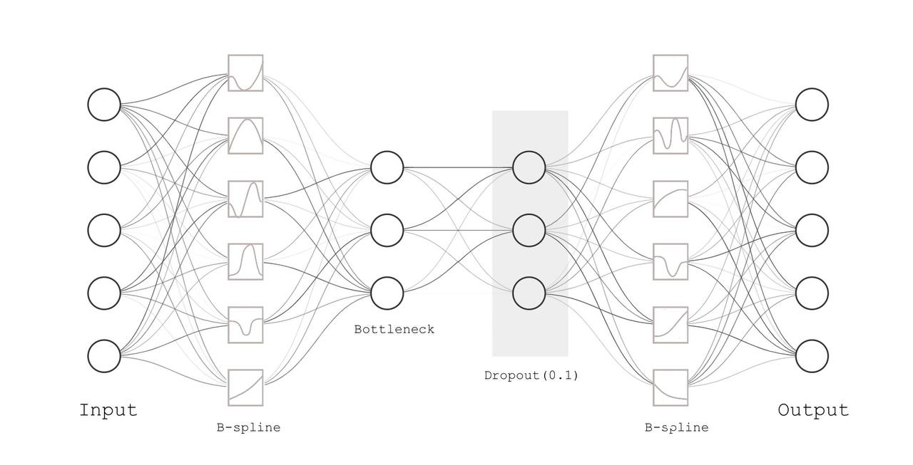

# User-based collaborative filtering recommender system with Denoising Autoencoder with KAN Layers

For reinformance-based recommendation system, please refer to https://github.com/NGYeung/RL-playground/tree/main

This repository provides an implementation of a user-based CF rating prediction algorithm using and KAN based autoencoder.

_The Implementation of KAN: [FastKan](https://github.com/ZiyaoLi/fast-kan)_


_Repository Structure:_

```plaintext
.
├── Recommender.ipynb
├── Recommender.py
├── model
│   ├── AutoEncoders.py
│   ├── pre_trained.pt
├── MovieLens4Colab.py
├── MovieLens100K.yaml
└── MovieLens1M.yaml
```

## Introduction

Here is a brief introduction to everything touched in this repository... The article is in production, but here is a preview...

### Collaborative Filtering

Collaborative Filtering is a subset of recommender systems that suggests items to users based on the similarities among the users and items. In other words, it predicts a user's interest in an item given previous user-item interactions. It's widely applied in e-commerce and social media recommendations.

### AutoRec with MLP

[AutoRec](https://users.cecs.anu.edu.au/~akmenon/papers/autorec/autorec-paper.pdf) is proposed by S Sedhain et al. in 2015. It directly takes the documented ratings as the input and uses autoencoders' great ability at learning the latent representations to predict users' preference (ratings) of uncountered items. 

*The problem statement:*
Suppose we have $`m`$ users and $`n`$ items in the dataset, the dataset $`D`$ provides us with a partial observation of the user-item interaction matrix $`R`$, the i-th row of which is the rating from the i-th user for all items. Thus, we can conveniently denote user preferences as $`u_1, \cdots, u_m \in \mathbb{R}^n`$. 

The autoencoder receives known ratings as the input, encodes them as a low-dimensional representation, and recovers the rating through a decoder structure. Let's denote the reconstruction of rating $`r`$ as $`\tilde r = h(r)`$. The algorithm solves the following optimization problem. 

$$\min \limits_{r\in D} \| r - h(r;\theta) \|_2^2$$

Here, the map $h'(r)$ can be written as
$$h(r;\theta) = f(W+g(Vr+\mu)+b)$$
where $`\theta = \{W,V, \mu, b\}`$ and $`f`$ and $`g`$ are activition functions.


### Kolmogorov-Arnold Network (KAN)

MLPs are awesome approximators of functions, and neural Networks as huge black boxes work on the assumption that the gazillion of parameters will successfully model the latent relations among observations. 

[Kolmogorov-Arnold Network](https://arxiv.org/abs/2404.19756), proposed by Z liu et al. is an alternative neural network structure to MLPs based on the Kolmogorov-Arnold representation theorem in mathematical analysis. KAN replaces the linear weights and fixed activation functions in MLPs with non-linear learnable activations.

Let's put this in mathematical terms. A function $`f(x)`$ is approximated by MLPs as

$$ f(x)  = \sum \limits_i \alpha_i \sigma(w_i x + b_i)$$

where $'w_i, b_i,\sigma'$ are, respectively, the weights, biases, and the activation function.
On the other hand, KAN approximates any continuous function $`f(x)`$ as

$$f(\mathbf{x}) = f(x_1, \ldots, x_n) = \sum_{q=0}^{2n} \Phi_{q} \left( \sum_{p=1}^{n} \phi_{q,p}(x_{p}) \right)$$

Depending on the implementation, $`\phi`$ is chosen as b-splines or chebyshev polynomials. $`\Phi`$ in most cases, are linear operators that can be represented with matrices. Readers can refer to equation (2.6) in the KAN paper.


## The Model

AutoRec aims to map the partial observations to the full rating matrix, and the intuition is to equip the architecture with stronger approximator of functions. That is, the KAN layers. Let $$\Phi_i$$ be the learnable in the i-th KAN layer, the reconstruction of user preference $$u_j$$ can be written as

$$\tilde u_j = \Phi_1 \circ \cdots \circ \Phi_k (u_j)$$

Thus, the optimization problem to solve becomes

$$\min \limits_{\{\Phi\}} \Phi_1 \circ \cdots \circ \Phi_k (u_j) + \Omega_{regularization}$$

*$`A \circ B = A(B)`$ is the notation for function compositions.*


### An Illustration of the model




## Results and Visualization

In this section, we provide experiment results and present how KAN can potentially contribute to the interpretability.


### Dataset 1: [MovieLens1M](https://grouplens.org/datasets/movielens/1m/)

The dataset contain 1,000,209 anonymous ratings of approximately 3,900 movies 
made by 6,040 MovieLens users who joined MovieLens in 2000.


_Train-test split: 9:1, 10-fold cross-validatoin for ML-1M, and the RMSE is calculated as_ $`\sqrt{0.1\sum_i RMSE_i}`$
